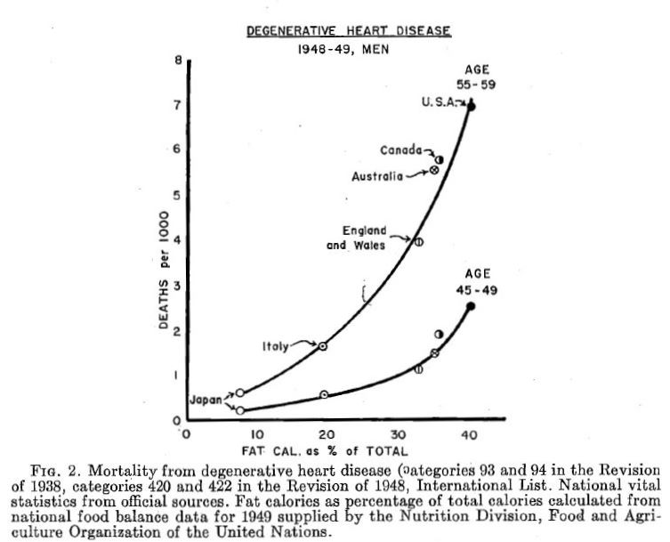

```{r setup, include=FALSE}
knitr::opts_chunk$set(echo = TRUE)
```

## Introductory words

This script leads through a very short analysis, I performed for a small side project I'm currently involved in. This side project deals with the current understanding of the role of cholesterol (and diet) on the risk of cardiovascular diseases. As it turned out, still many involved people cite the classic study of Ancel Keys, which is based on data on diet and health from men from seven countries, collected in the 1960s. [Published](https://www.cabdirect.org/cabdirect/abstract/19711403775) in 1970, this analysis was the foundation for the currently still prevalent idea of 'bad' cholesterol. From the information I have sighted so far, I start to doubt that there is much scientific merit in the cholesterol hypothesis (very interesting publications can be found e.g. [here](http://www.egms.de/static/en/journals/gms/2007-5/000040.shtml), [here](http://www.mdpi.com/2072-6643/7/10/5429) and [here](http://www.scirp.org/journal/PaperInformation.aspx?PaperID=34065) ). And never to forget [this](http://journals.plos.org/plosmedicine/article?id=10.1371/journal.pmed.0020124).

When reading about the original study I saw that Keys necessarily was confronted with rescrictions regarding sample size and data quality. Amongst other problems, he could for example not directly measure the serum cholesterol levels. So my idea was to gather more data of better quality and repeat this simple regression - the result can be found below for the year 2000. It is very important to note that this document / repo does not aim at being a scientific publication. I will not dive into deep interpretations, comparisons or an answer on the cholesterol question - this can simply not be done with this analysis. Yet, it might just be interesting to show, how easily we can target questions in these days of improved data availability. 

Last important note: I did not find anything, but am actually not willing to believe that nobody has done this before. So, whomever has analyzed these data before: I apologize for not having seen your work. Part of the reason might be that I am actually an evolutionary ecologist, so I'm not too familiar with medicinal literature. Please contact me in this case so I can mention your great work here!

Very last important note: I have only worked on this for a day and am a single person. If you spot any errors, please tell me! If you have ideas to further improve this analysis - we're on github :-) Just fork it and have fun!

## Data preparation

All data used in this study are obtained from the [Global Health Observatory data repository](http://apps.who.int/gho/data/node.home) from the [World Health Organization](http://who.int/en/). The data used are those on deaths by cardiovascular diseases per country and averaged mean total cholesterol (age-standardized) per country. The brand-new R package ['rgho'](https://github.com/pierucci/rgho) made it very easy to extract the data and get them into R (with just some side work noted). I am very grateful to [Antoine Filipović-Pierucci](https://pierucci.org/) for the great work!

```{r warning=FALSE}
library(rgho) # loading the library

# the GHO code for the deaths of cardiovascular diseases per 100.000 inhabitants is
# WHS2_131 (which I actually had to extract from the GHO homepage, since the codes 
# provided by the R package seem to be incorrect in this case).
# the adequate code for the age-standardized mean total cholesterol is CHOL_03

# 1. cholesterol data

chol = data.frame(get_gho_data("CHOL_03",dimension="GHO"))

# as we see from here, we have got a record over 60 years
sort(unique(chol$YEAR)) # ranging from 1980 to 2009

# 2. cvd data

cvd = data.frame(get_gho_data("WHS2_131",dimension="GHO"))

# unfortunately we only have data for the years 2000 and 2012
sort(unique(cvd$YEAR))

### picking a year

# I will thus in the following concentrate on the year 2000, for which we have both
# variables available
chol_2000 = subset(chol,YEAR==2000)

# and average only the mean numeric value across sexes (not perfect yet, but good 
# enough for a first glimpse)
chol_2000 = tapply(chol_2000$Numeric,list(chol_2000$COUNTRY),mean)

# we now have data on all 193 WHO member states - for each country the mean total
# cholesterol of all people over age 25
length(chol_2000)

# here we need to make sure that the cause of death is cardiovascular disease, coded 
# as "GHE110" and we choose only the "both sexes" value, which is a better estimate 
# than the mean of males and femalse
cvd_2000 = subset(cvd,YEAR==2000&GHECAUSES=="GHE110"&SEX=="BTSX")
# thus no need to average anything, so this just extracts the mean value, but keeps 
# the country information
cvd_2000 = tapply(cvd_2000$Numeric,list(cvd_2000$COUNTRY),mean)

# since we have only data for about 170 countries on cvd, but far more for 
# cholesterol levels, we need to extract the relevant ones from the latter. 
# therefore, we first extract the countrie names lists:

chol_cs = unlist(dimnames(chol_2000))
cvd_cs = unlist(dimnames(cvd_2000))

# since we seem to have more data on cholesterol, let's extract only those countries, 
# for which we do have the according cvd data:

chol_2000 = chol_2000[which(chol_cs %in% cvd_cs)]

length(chol_2000); length(cvd_2000)

# comparing the length, we do, however, notice that now we have one further data point 
# for cvd than for cholesterol. let's find out, for which country we do not have
# cholesterol data:

which(unlist(dimnames(chol_2000))!=unlist(dimnames(cvd_2000)))

# aha, the first one is element 145, from which the problems arise. this is
# "unlist(dimnames(cvd_2000))[145]"=="SSD". we remove this element from our cvd list:

cvd_2000 = cvd_2000[-145]

# final check:
table(unlist(dimnames(chol_2000))==unlist(dimnames(cvd_2000)))

# finally I will transform the cholesterol data to the in our regions typical dimensions 
# of mg/dl (as they have been delivered in mmol/l)

chol_2000 = chol_2000 * 38.67

# perfect! data aquisition is done and we can go on with the analysis.
```

## A short look onto the older data:

I would like to compare the following results with the original data from Keys. Unfortunately I was not able to find the raw data or online versions of the graphs (I know, that had been different times). Yet, I could at least find one from a preliminary study, reused by Yerushalmy and Hilleboe (1957, Stat J Med 57: 2343-54). What a correlation:

```{r, out.width = "400px", echo=FALSE}

```

## New regression results:

```{r echo=FALSE, out.width = "400px"}
par(mar=c(5,7,1,1),bty="l")
x = as.numeric(chol_2000)
y = as.numeric(cvd_2000)
plot(x,y,cex.axis=1.05,cex.lab=1.25,xlab="Mean total cholesterol (age-standardized; mg/dl)",
     ylab="Deaths by cardiovascular disease\n per 100,000",cex=1.05,pch=16)
m1 = lm(y~x)
abline(m1,lwd=2,col="red")
text(220,700,expression(paste("adj. ",R^2,"=0.034")),adj=1,cex=1.5)
```

This looks like a pretty bad predictor for CVD deaths. The explained variance is close to zero. If at all, there could be a hint towards a negative relationship, but given an $R^2$ of 0.034, no further discussion is necessary.

## One last note on statistics...

I thought it would be fun to extract the countries from the original curve shown earlier by Yerushalmy and Hilleboe and do the regression only with these:

```{r echo=FALSE, out.width = "400px"}
country_names=unlist(dimnames(chol_2000))
orig_countries = c("USA","CAN","AUS","GBR","ITA","JPN")
orig_pos = which(country_names %in% orig_countries)

chol_orig = chol_2000[orig_pos]
cvd_orig = cvd_2000[orig_pos]

par(mar=c(5,7,1,1),bty="l")
x = as.numeric(chol_2000)
y = as.numeric(cvd_2000)
plot(x,y,cex.axis=1.05,cex.lab=1.25,xlab="Mean total cholesterol (age-standardized; mg/dl)",
     ylab="Deaths by cardiovascular disease\n per 100,000",cex=1.05,pch=16,col="grey75")

x = as.numeric(chol_orig)
y = as.numeric(cvd_orig)
m1 = lm(y~x)
abline(m1,lwd=2,col="red")
points(x,y,cex=1.05,pch=16)
text(y~x,labels=sort(orig_countries),pos=c(4,2,4,4,4,4))


text(220,700,expression(paste("adj. ",R^2,"=0.234")),adj=1,cex=1.5)
```

That is funny: of course we see by the ordering of the data points that these data do not resemble the original ones perfectly (but see Japan). Yet, just based on the low sample size, these six nations (which seem to suffer fairly weakly from CVD) would indicate a positive relationship, as suggested by Keys et al.; the explained variance is higher by accident. You should always avoid low sample size. The statistics can never be better than the data.

## Concluding remarks

According to this little exercise mean cholesterol does either not have any value for predicting the death by cardiovascular disease (and probably just has nothing to do with it?) or the analysis is good enough to find anything (e.g. by averaging out individual differences). Yet, it is important to note: the original study had the same fundamental problems, since the design was identical, but the WHO data are of higher quality and quantity.